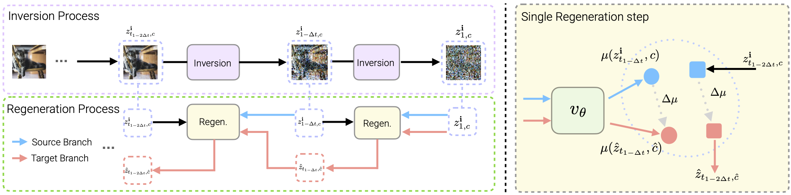

<div align="center">
<br>
<h2>InstantEdit: Text-Guided Few-Step Image Editing with Piecewise Rectified Flow</h2>

[Yiming Gong](https://github.com/nickgong1);  [Zhen Zhu](https://zzhu.vision); [Minjia Zhang](https://minjiazhang.github.io/)
<br>

 University of Illinois Urbana-Champaign&nbsp;


[]()
[]() 
[](https://opensource.org/licenses/MIT)

  



</div>

## Overview
We propose a fast text-guided image editing method called InstantEdit based on the RectifiedFlow framework, which is structured as a few-step editing process that preserves critical content while following closely to textual instructions. Our approach leverages the straight sampling trajectories of RectifiedFlow by
introducing a specialized inversion strategy called PerRFI. To maintain consistent while editable results for RectifiedFlow model,
we further propose a novel regeneration method, Inversion Latent Injection, which effectively reuses latent information obtained during inversion to facilitate more coherent and detailed regeneration. Additionally, we propose a Disentangled Prompt Guidance technique to balance editability with detail preservation, and integrate a Canny-conditioned ControlNet to incorporate structural cues and suppress artifacts. Evaluation on the PIE image editing dataset demonstrates that InstantEdit is not only fast but also achieves better qualitative and quantitative results compared to state-of-the-art few-step editing methods.

## Getting Started

### Setup
1. Clone the repository
```
git clone https://github.com/Supercomputing-System-AI-Lab/InstantEdit.git
cd InstantEdit
```
2. Create and activate the Conda environment:
```
conda env create -f environment.yml
conda activate InstantEdit
```
### Run PIE Evaluation
1. Download PIE Benchmark  
You can download the PIE benchmark from [here](https://docs.google.com/forms/d/e/1FAIpQLSftGgDwLLMwrad9pX3Odbnd4UXGvcRuXDkRp6BT1nPk8fcH_g/viewform) by filling in the form from the original authors.

2. A minimal script to run
```
python instantedit.py --dataset_path $Your PIE dataset path$
```

### Run Per-image editing 
```
python demo.py$ 
```

## Bibtex

## Acknowledgement
- Part of our code is adopted from the implementation of [P2P](https://github.com/google/prompt-to-prompt) and [InfEdit](https://github.com/sled-group/InfEdit). We thank the authors for releasing their code.
- We reuse the PIE evaluator from [DirectInversion](https://github.com/cure-lab/PnPInversion)

## TODO List
1. remove all hard-coding code snippet


